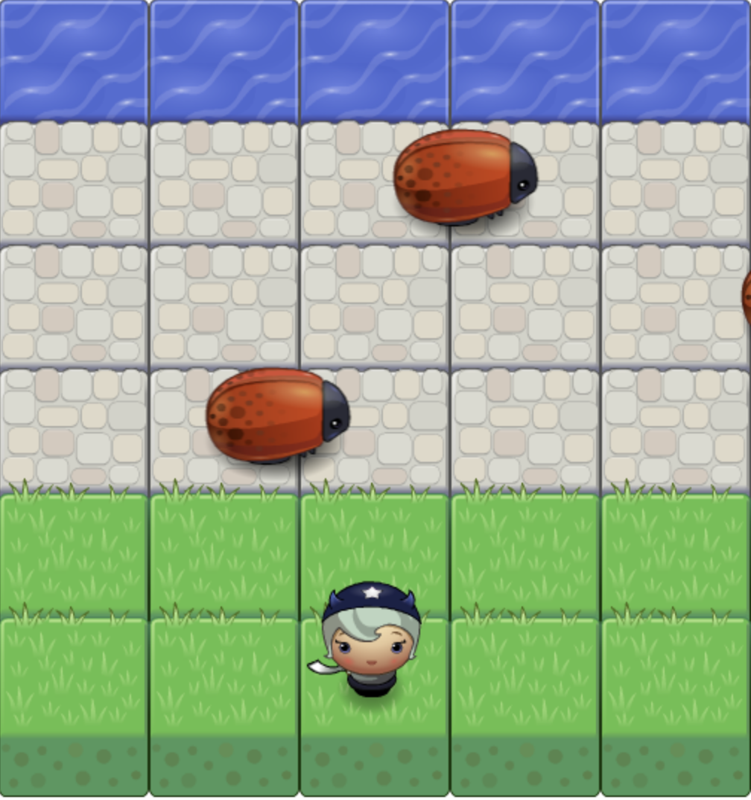

# Classic Arcade Game Clone Project

## Table of Contents

- [Instructions](#instructions)
- [Contributing](#contributing)

## Instructions

Move the character with left, right, top, bottom in keyboard. If you crash with bugs, then you will be back to the starting point. If you cross the grass safely, you win.

## Contributing

Starter code from Udacity.
